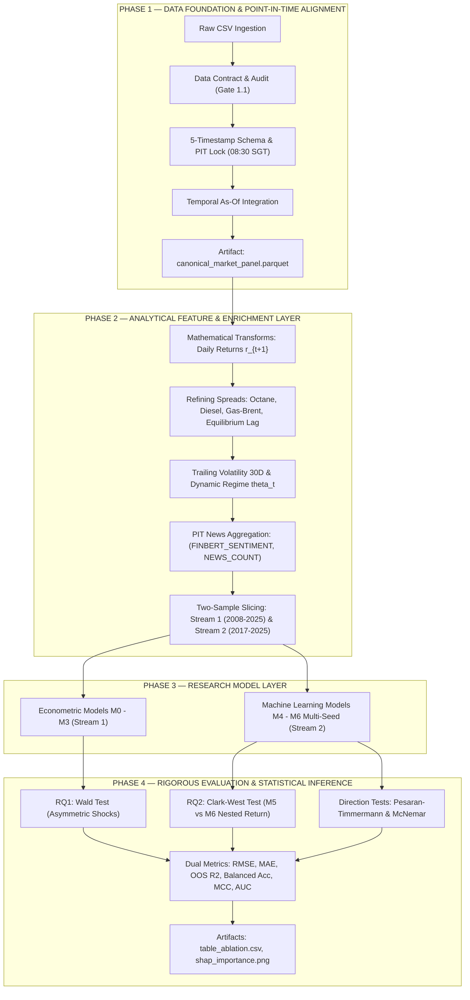

# BẢN ĐẶC TẢ KIẾN TRÚC HỆ THỐNG & ĐỀ CƯƠNG THỰC NGHIỆM TOÀN DIỆN (V5.2)
# DỰ BÁO TỶ SUẤT THAY ĐỔI & HƯỚNG BIẾN ĐỘNG CHUẨN GIÁ PLATTS FOB SINGAPORE MOGAS 95: QUẢN TRỊ DỮ LIỆU POINT-IN-TIME, KINH TẾ LỌC DẦU & HỌC MÁY ĐA MẪU
## SINGAPORE PETROLEUM ASYMMETRIC FORECASTING SYSTEM (SPAFS V5.2 - PRODUCTION-GRADE & TEMPORAL GOVERNANCE EDITION)

**Phiên bản:** V5.2 — Data Foundation, Point-in-Time Governance, Two-Sample Framework & Rigorous Inference Edition  
**Chuỗi dữ liệu chuẩn gốc (Ground-Truth Benchmark):** Platts FOB Singapore Mogas 95 Assessment (02/05/2008 – 31/12/2025, 4,559 dòng quan sát, 4,430 ngày giao dịch thực tế, 4,425 ngày giao dịch đồng bộ hoàn hảo)  
**Tần suất thực nghiệm:** Daily Primary ($N = 4,425$) & Weekly Robustness ($N \approx 900$)  
**Mục tiêu học thuật:** Khóa luận Tốt nghiệp Điểm Tuyệt đối (9.5–10.0) / Nghiên cứu Khoa học Sinh viên Cấp Bộ / Công bố Quốc tế Scopus Q2/Q3 (*Energy Economics, Energy Reports, Applied Energy, IJEEP*)

---

## MỤC LỤC TOÀN DIỆN

1. [BÀI TOÁN CỐT LÕI & CƠ CHẾ KINH TẾ LỌC DẦU](#1-bài-toán-cốt-lõi--cơ-chế-kinh-tế-lọc-dầu)
   - 1.1. Bản chất thị trường: Platts MOC Benchmark Assessment vs Giao dịch vật lý giao ngay
   - 1.2. Phân cấp 3 định dạng Target: Return ($r_{t+1}$) là Primary, Direction ($y_{t+1}$) là Secondary, Dynamic Regime ($\theta_t$)
   - 1.3. Hai câu hỏi nghiên cứu cốt lõi (RQ1 Kinh tế lượng vs RQ2 Học máy & Dòng tin tức)
   - 1.4. Thiết kế Đa tần số: Daily Primary ($N = 4,425$) vs Weekly Robustness ($N \approx 900$)

2. [QUẢN TRỊ THỜI GIAN: POINT-IN-TIME (PIT) CONTROL PLANE](#2-quản-trị-thời-gian-point-in-time-pit-control-plane)
   - 2.1. Bản chất: PIT Governance là Control Plane xuyên suốt, không phải tiền xử lý thứ cấp
   - 2.2. Hệ trục 5 mốc thời gian thực quản trị dữ liệu (5-Timestamp Governance Model)
   - 2.3. Khóa cứng mốc thông tin Cutoff $t_{origin} = \text{08:30 SGT sáng ngày } t+1$
   - 2.4. Giải trình học thuật minh bạch (Transparency Caveat cho RQ1)
   - 2.5. Xử lý Roll hợp đồng tương lai dầu thô Brent (Within-Contract Return)

3. [KHUNG THIẾT KẾ HAI MẪU NGHIÊN CỨU ĐỘC LẬP (TWO-SAMPLE FRAMEWORK)](#3-khung-thiết-kế-hai-mẫu-nghiên-cứu-độc-lập-two-sample-framework)
   - 3.1. Lý do chia mẫu: Tránh lỗi thiên lệch "Zero Ambiguity" giai đoạn 2008–2016 của GDELT
   - 3.2. Luồng 1 (Full Historical Econometric Sample 2008–2025, $N = 4,425$): RQ1 & Models $M0 \to M3$
   - 3.3. Luồng 2 (Aligned NLP Subsample 2017–2025, $N = 2,257$): RQ2 & Models $M4 \to M6$
   - 3.4. Phân vùng Luồng 2: Train (2017–2019, $N=749$) và Out-of-Sample Test (2020–2025, $N=1,508$)

4. [ÁNH XẠ 15 HẠNG MỤC DỮ LIỆU DOANH NGHIỆP VÀO 6 LAYER HỆ THỐNG](#4-ánh-xạ-15-hạng-mục-dữ-liệu-doanh-nghiệp-vào-6-layer-hệ-thống)
   - 4.1. Bảng đối chiếu 15 nghiệp vụ dữ liệu doanh nghiệp và đặc thù SPAFS
   - 4.2. Cấu trúc 6 Layer dữ liệu công nghiệp
   - 4.3. Triết lý tài chính: "Outlier Detection $\neq$ Outlier Removal" (Bảo tồn cú sốc kinh tế thực)
   - 4.4. Deduplication theo Khóa chính thị trường $\text{Primary Key} = (\text{market\_date}, \dots)$
   - 4.5. Tách biệt tuyệt đối: Data Transformation vs Feature Engineering
   - 4.6. Data Integration có chiều thời gian (Temporal As-Of Integration)
   - 4.7. Data Enrichment đa phương thức (IESG + GDELT GKG/BigQuery + FinBERT + Tone Baseline)

5. [KHÔNG GIAN ĐẶC TRƯNG & KỸ THUẬT KINH TẾ LỌC DẦU](#5-không-gian-đặc-trưng--kỹ-thuật-kinh-tế-lọc-dầu)
   - 5.1. Chênh lệch phẩm cấp xăng Octane Spread ($MG95 - MG92$)
   - 5.2. Chênh lệch xăng - dầu Diesel Spread ($MG95 - DO\_005$)
   - 5.3. Biên lọc dầu Singapore Gasoline-Brent Spread ($MG95 - Brent$)
   - 5.4. Mỏ neo cân bằng dài hạn Lagged Spread $(MG95 - Brent)_{t-1}$ (Thay thế ECM)
   - 5.5. Phân tách cú sốc dầu Brent bất đối xứng ($r_{Brent, t}^+$ và $r_{Brent, t}^-$)
   - 5.6. Độ biến động quá khứ 30 ngày (Trailing Volatility) & Ngưỡng động $\theta_t = 0.5 \times \text{VOL\_30D}_t$

6. [MA TRẬN 7 MÔ HÌNH THỰC NGHIỆM ($M0 \to M6$) & PHƯƠNG PHÁP ƯỚC LƯỢNG](#6-ma-trận-7-mô-hình-thực-nghiệm-m0--m6--phương-pháp-ước-lượng)
   - 6.1. Chi tiết ma trận 7 mô hình thực nghiệm
   - 6.2. Nhánh Kinh tế lượng: Mô hình Asymmetric Distributed Lag (ADL) & Kiểm định Wald
   - 6.3. Nhánh Học máy: Cấu hình LightGBM cây nông kiểm soát quá khớp & Quy trình 10 Random Seeds ($\mu \pm \sigma$)

7. [HỆ THỐNG KIỂM ĐỊNH THỐNG KÊ CHUẨN MỰC & ĐÁNH GIÁ KÉP](#7-hệ-thống-kiểm-định-thống-kê-chuẩn-mực--đánh-giá-kép)
   - 7.1. Kiểm định Clark & West (2007) cho hai mô hình lồng nhau $M5 \subset M6$
   - 7.2. Kiểm định Diebold & Mariano (1995) / Harvey, Leybourne, Newbold (HLN 1997)
   - 7.3. Kiểm định hướng giá phi tham số Pesaran & Timmermann (PT 1992, 2009)
   - 7.4. Kiểm định so sánh cặp phân loại McNemar Test
   - 7.5. Bộ chỉ số đánh giá kép (Dual Metrics: RMSE, MAE, OOS $R^2$, Balanced Acc, Macro F1, MCC, ROC-AUC)

8. [QUY TRÌNH 4 PHASE TRIỂN KHAI DỰ ÁN](#8-quy-trình-4-phase-triển-khai-dự-án)
   - 8.1. Sơ đồ luồng hoạt động tổng thể (Pipeline Flowchart)
   - 8.2. Phase 1: Data Foundation & Point-in-Time Alignment (Step 1.1 $\to$ Step 1.3)
   - 8.3. Phase 2: Analytical Feature & Enrichment Layer (Step 2.1 $\to$ Step 2.5)
   - 8.4. Phase 3: Research Model Layer (Step 3.1 $\to$ Step 3.7)
   - 8.5. Phase 4: Rigorous Evaluation & Statistical Inference Layer (Step 4.1 $\to$ Step 4.5)

9. [KẾT QUẢ THỰC NGHIỆM BƯỚC ĐẦU & BIÊN BẢN KIỂM TOÁN](#9-kết-quả-thực-nghiệm-bước-đầu--biên-bản-kiểm-toán)
   - 9.1. Biên bản kiểm toán dữ liệu Gate 1.1 (Platts Data Contract)
   - 9.2. Kết quả kiểm định Wald cho RQ1 (Truyền dẫn đối xứng ở cấp độ bán buôn)
   - 9.3. Bảng hiệu năng Out-of-Sample 6 năm (2020–2025) cho $M0 \to M5$

10. [CẤU TRÚC THƯ MỤC LƯU TRỮ VÀ ARTIFACTS DỰ ÁN](#10-cấu-trúc-thư-mục-lưu-trữ-và-artifacts-dự-án)

---

# 1. BÀI TOÁN CỐT LÕI & CƠ CHẾ KINH TẾ LỌC DẦU

### 1.1. Bản chất thị trường: Platts MOC Benchmark Assessment vs Giao dịch vật lý giao ngay
Singapore là trung tâm lọc hóa dầu và đầu mối giao dịch nhiên liệu lớn nhất khu vực Châu Á – Thái Bình Dương. Nhằm bảo đảm tính chuẩn xác và an toàn tuyệt đối về mặt học thuật:
* **Không gọi Platts MG95 là "giá giao dịch vật lý thực tế" (*actual physical transaction price*).**
* **Định danh khoa học chính xác:** **Platts FOB Singapore Mogas 95 Assessment** là một **chỉ số đánh giá giá chuẩn (*Benchmark Price Assessment*)** do S&P Global Platts công bố vào cuối phiên định giá Market-on-Close (MOC 16:30 SGT, UTC+8).
* **Quy chuẩn giao nhận:** Hàng hóa (cargoes) được đưa vào xem xét trong đánh giá FOB Singapore có kỳ hạn giao hàng từ **15 đến 30 ngày tới** kể từ ngày giao dịch đánh giá.
* **Bản chất bài toán dự báo:** Mô hình thực hiện **dự báo bước nhảy ngày tiếp theo của chỉ số giá chuẩn (*Next-day movement of the benchmark assessment*)**, không phải dự báo giá hợp đồng giao ngay tại cổng nhà máy.

### 1.2. Phân cấp 3 định dạng Target
Mô hình loại bỏ triệt để việc dự báo mức giá danh nghĩa ($P_{t+1} \text{ USD/bbl}$) do chuỗi giá có tính tự tương quan quá cao (*strong persistence/autocorrelation*), khiến mô hình Random Walk Naive ($P_{t+1} \approx P_t$) đánh lừa các chỉ số thống kê nhưng không tạo ra giá trị kinh tế.

Hệ thống phân cấp 3 định dạng biến mục tiêu:
1. **Primary Target (Bắt buộc cho RQ1 & RQ2):** Tỷ suất thay đổi logarit hàng ngày (Daily Continuous Return):
   $$r_{MG95, t+1} = \ln\left(\frac{P_{MG95, t+1}}{P_{MG95, t}}\right) \times 100\%$$
   $\to$ Chuỗi dừng $I(0)$, ép thuật toán phải học tín hiệu thực từ động lượng (*momentum*), độ biến động (*volatility*), tương quan liên sản phẩm (*cross-product spreads*) và dòng thông tin (*information flow*).
2. **Secondary Target (Bổ trợ ra quyết định):** Hướng biến động nhị phân (Binary Direction):
   $$y_{t+1} = \mathbb{I}[r_{MG95, t+1} > 0] \in \{0, 1\}$$
3. **Optional Robustness (Chế độ 3 vùng chuẩn hóa biến động):**
   $$\theta_t = 0.5 \times \text{VOL\_MG95\_30D}_t$$
   $$y_{t+1}^{tri} = \begin{cases} +1 & \text{khi } r_{MG95, t+1} > \theta_t \quad (\text{Tăng mạnh}) \\ 0 & \text{khi } |r_{MG95, t+1}| \le \theta_t \quad (\text{Ổn định}) \\ -1 & \text{khi } r_{MG95, t+1} < -\theta_t \quad (\text{Giảm mạnh}) \end{cases}$$
   Việc chuẩn hóa ngưỡng $\theta$ theo biến động 30 ngày giúp tỷ lệ phân bổ các lớp cân bằng qua các thời kỳ thị trường sóng gió hay êm đềm, tránh reviewer bắt bẻ về tính tùy tiện khi chọn ngưỡng tĩnh $\pm 1.0\%$.

### 1.3. Hai câu hỏi nghiên cứu cốt lõi (RQ1 & RQ2)

$$\boxed{\textbf{RQ1 (Kinh tế lượng - Asymmetric Shocks): } \text{Các cú sốc tăng và giảm từ dầu thô Brent có truyền dẫn bất đối xứng vào tỷ suất sinh lời của Platts MG95 hay không?}}$$
* **Phương pháp kiểm chứng:** Mô hình **Asymmetric Distributed Lag (ADL)** kết hợp **Kiểm định Wald** với giả thuyết vô hiệu:
  $$H_0: \beta^+ = \beta^- \quad \text{và} \quad H_0: \sum_{q=0}^Q \beta_q^+ = \sum_{q=0}^Q \beta_q^-$$
  Kiểm định được thực hiện với ma trận hiệp phương sai vững Newey-West HAC. (Loại bỏ hoàn toàn Cointegration/ECM vì target là chuỗi Return $I(0)$).

$$\boxed{\textbf{RQ2 (Học máy - Information Flow Value): } \text{Khối thông tin tin tức tài chính (gồm điểm FinBERT và tần suất tin) có mang lại giá trị dự báo gia tăng ngoài mẫu (OOS) so với khối biến kinh tế hay không?}}$$
* **Phương pháp kiểm chứng:** Thiết kế đối chứng trực diện sạch **$M5$ (Economic LightGBM)** vs **$M6$ (Economic + News LightGBM)** trên cùng một mẫu dữ liệu đối chứng (2017–2025). Đánh giá bằng **Kiểm định Clark & West (2007)** cho hồi quy return, và đo lường **Balanced Accuracy, Macro F1, MCC, ROC-AUC, PT Test, McNemar Test** cho hướng giá.

### 1.4. Thiết kế Đa tần số: Daily Primary vs Weekly Robustness
* **PRIMARY FRAMEWORK: TẦN SỐ NGÀY (DAILY, $N = 4,425$):**
  * Đóng vai trò là khung phân tích chính, tối ưu hóa năng lực học của thuật toán Tabular Machine Learning (LightGBM) và phân tách độ trễ động lực học ngắn hạn.
* **ROBUSTNESS FRAMEWORK: TẦN SỐ TUẦN (WEEKLY, $N \approx 900$):**
  * Đóng vai trò là bài kiểm tra tính nhất quán theo tần số (*Frequency Consistency / Temporal Aggregation Robustness*).

---

# 2. QUẢN TRỊ THỜI GIAN: POINT-IN-TIME (PIT) CONTROL PLANE

### 2.1. Bản chất: PIT Governance là Control Plane xuyên suốt
Trong các hệ thống phân tích dữ liệu thông thường, tiền xử lý dữ liệu thường là một chuỗi tuyến tính đơn giản: `load -> clean -> join -> feature`. Tuy nhiên, với dữ liệu chuỗi thời gian thị trường tài chính, **Temporal Integrity / Point-in-Time (PIT) Control** phải là một **mặt bằng kiểm soát (Control Plane) độc lập chạy xuyên suốt từ Ingestion đến Downstream Serving**.

Nếu không kiểm soát mốc thời gian chặt chẽ, mô hình sẽ gặp lỗi **Lookahead Bias (rò rỉ tương lai)** — lỗi nghiêm trọng nhất phá hủy hoàn toàn giá trị học thuật của một bài báo tài chính.

### 2.2. Hệ trục 5 mốc thời gian thực quản trị dữ liệu (5-Timestamp Governance Model)
Hệ thống SPAFS V5.2 thiết lập hợp đồng quản trị dữ liệu với 5 mốc thời gian chuẩn hóa:
```text
1. observation_datetime:        Thời điểm giao dịch/sự kiện thực tế phát sinh trên thị trường.
2. publication_datetime:        Thời điểm nhà cung cấp (Platts, ICE, GDELT) chính thức phát hành bản tin.
3. availability_datetime:       Thời điểm hệ thống dữ liệu thực sự tải và xác nhận bản ghi vào database.
4. forecast_origin_datetime:    Mốc Cutoff nghiêm ngặt (t_origin) để chốt tập thông tin dự báo.
5. target_market_date:          Ngày giao dịch mục tiêu của tài sản cần dự báo (D_{t+1}).
```

**Quy tắc Bất biến (Hard Gate Rule):**
$$\boxed{\text{availability\_datetime} \le \text{forecast\_origin\_datetime} \quad (100\% \text{ Pass/Fail Gate})}$$
Bất kỳ đặc trưng nào vi phạm quy tắc này sẽ lập tức kích hoạt lỗi dừng hệ thống (`DataContractViolationError`), không cho phép nạp vào mô hình.

```
D_{t} (Hôm qua)                                  D_{t+1} (Hôm nay - Ngày dự báo)
───┼───────────────────────────────────────────────┼─────────────────────────────┼──────────────►
 16:30 SGT                                      03:00 SGT                    08:30 SGT      16:30 SGT
 Platts MOC                                    Brent Settlement             CUTOFF         Platts MOC
 Chốt giá P_t                                  Sàn London chốt              t_origin       Chốt giá P_{t+1}
 [HOÀN TẤT]                                    [HOÀN TẤT]                   [KHÓA TẬP TIN] [MỤC TIÊU CẦN ĐOÁN]
```

### 2.3. Khóa cứng mốc thông tin Cutoff $t_{origin} = \text{08:30 SGT sáng ngày } t+1$
* **Platts MOC Singapore:** Đóng cửa lúc **16:30 SGT (UTC+8)** ngày $D_t$.
* **ICE Brent Futures (`BZ=F`):** Chốt phiên tại London/New York vào khoảng **02:30 – 03:30 SGT sáng ngày hôm sau** ($D_{t+1}$).
* **Điểm chốt $t_{origin}$:** Cố định vào lúc **08:30 SGT sáng ngày $D_{t+1}$**.
  * Tại thời điểm này, giá Platts $P_{MG95, t}$ và giá thanh toán Brent $P_{Brent, t}$ đều đã chính thức hoàn tất và sẵn sàng 100%.
  * Mọi tin tức GDELT xuất bản trước 08:30 SGT sáng ngày $D_{t+1}$ đều được nạp đầy đủ.
* **Mục tiêu cần dự báo:** Bước nhảy tỷ suất sinh lời tại phiên MOC lúc **16:30 SGT chiều ngày $D_{t+1}$**.

### 2.4. Giải trình học thuật minh bạch (Transparency Caveat cho RQ1)
Cần nêu rõ trong tài liệu học thuật: Vì Brent giao dịch sau giờ đóng cửa Platts 16:30 SGT, biến $r_{Brent, t}$ chứa thông tin qua đêm tại phương Tây. Do đó, kết quả kiểm định Wald của RQ1 phản ánh sự kết hợp giữa **cơ chế truyền dẫn kinh tế của nhà máy lọc dầu** và **độ trễ đồng bộ hóa múi giờ (synchronization / overnight lag)**, không đơn thuần là quán tính điều chỉnh giá thuần túy.

### 2.5. Xử lý Roll hợp đồng tương lai dầu thô Brent
Chuỗi `BZ=F` là chuỗi ghép liên tục các hợp đồng tương lai gần hạn (front-month). Lợi suất ngày của Brent được tính toán theo chuỗi đã hiệu chỉnh nối tiếp (back-adjusted / within-contract return) để triệt tiêu các bước nhảy giả tạo cơ học do chênh lệch giữa hợp đồng đáo hạn và hợp đồng tháng kế tiếp (Roll yield / Contango / Backwardation). Kiểm toán dị thường xác nhận các bước nhảy lớn (> 20%) trong chuỗi là các biến cố kinh tế thực (khủng hoảng giá dầu tháng 03 và 04/2020), không phải lỗi nối hợp đồng.

---

# 3. KHUNG THIẾT KẾ HAI MẪU NGHIÊN CỨU ĐỘC LẬP (TWO-SAMPLE FRAMEWORK)

### 3.1. Lý do chia mẫu: Tránh lỗi thiên lệch "Zero Ambiguity"
Kho dữ liệu tin tức toàn cầu GDELT chỉ có độ bao phủ ổn định và đồng nhất từ năm **2017 trở đi**, trong khi tập dữ liệu Platts bắt đầu từ năm **2008**. Giai đoạn 2008–2016 có `NEWS_COUNT = 0` là do **thiếu dữ liệu lịch sử (unobserved)** chứ không phải thị trường không có tin tức. Nếu ép mô hình Machine Learning học trên toàn bộ chuỗi 2008–2025, thuật toán sẽ bị sai lệch trọng số và cơ chế chống nhập nhằng (Zero Ambiguity) bị phá vỡ.

Giải pháp khoa học chuẩn mực: Thiết lập khung nghiên cứu 2 mẫu độc lập.

```
TẬP DỮ LIỆU TOÀN VẸN (FULL SAMPLE): 2008 ──────────────────────────────────────► 2025 (N = 4,425)
[Phục vụ RQ1: Asymmetric ADL, Wald Test & Kinh tế lượng M0 - M3]

                                          TẬP MẪU ĐỐI CHỨNG NLP: 2017 ──────────► 2025 (N = 2,257)
                                          [Phục vụ RQ2: Clark-West Test & Học máy M4 - M6]
                                          ├──────── TRAIN ─────────┤├──── OUT-OF-SAMPLE TEST ────┤
                                            2017 - 2019 (N = 749)      2020 - 2025 (N = 1,508)
```

### 3.2. Luồng 1: Full Historical Econometric Sample (2008–2025, $N = 4,425$)
* **Mục tiêu:** Dành riêng cho **RQ1 (Asymmetric ADL)** và các mô hình kinh tế lượng cơ sở ($M0, M1, M2, M3$).
* **Quy mô:** $N = 4,425$ ngày giao dịch đồng bộ hoàn hảo (từ 09/05/2008 đến 31/12/2025).
* **Giá trị học thuật:** Tận dụng trọn vẹn 17.5 năm dữ liệu để kiểm định mối quan hệ truyền dẫn dầu thô $\to$ xăng qua các chu kỳ kinh tế lớn: Khủng hoảng tài chính toàn cầu 2008, đợt sụp đổ giá dầu 2014–2016, và đại dịch COVID-19 năm 2020.

### 3.3. Luồng 2: Aligned NLP Subsample (2017–2025, $N = 2,257$)
* **Mục tiêu:** Dành riêng cho **RQ2 (Giá trị dự báo gia tăng của tin tức: $M5$ vs $M6$)**.
* **Quy mô:** $N = 2,257$ ngày giao dịch (từ 03/01/2017 đến 31/12/2025).
* **Phân chia chặt chẽ:**
  * **In-sample Training Window (2017–2019):** $N_{train} = 749$ ngày giao dịch.
  * **Out-of-Sample Test Window (2020–2025):** $N_{test} = 1,508$ ngày giao dịch (bao phủ 6 năm OOS đầy đủ).
* **Tính công bằng tuyệt đối:** Cả $M5$ (Economic LightGBM) và $M6$ (Economic + News LightGBM) đều được huấn luyện trên **cùng một tập dữ liệu 100%**, loại bỏ hoàn toàn hiện tượng nhiễu do thiếu dữ liệu lịch sử.

---

# 4. ÁNH XẠ 15 HẠNG MỤC DỮ LIỆU DOANH NGHIỆP VÀO 6 LAYER HỆ THỐNG

### 4.1. Bảng đối chiếu 15 nghiệp vụ dữ liệu doanh nghiệp và đặc thù SPAFS

| STT | Nghiệp Vụ Doanh Nghiệp | Vai Trò Trong Dự Án SPAFS V5.2 | Mức Độ Bắt Buộc |
|:---:|:---|:---|:---:|
| **1** | **Data Ingestion** | Nạp đa nguồn: Platts CSV, Yahoo Finance Brent, GDELT GKG/BigQuery, IESG. | Bắt buộc |
| **2** | **Data Validation** | Thực thi Data Contract: Schema 5 cột, Date tăng đơn điệu, phạm vi 2008–2025. | Bắt buộc |
| **3** | **Data Cleaning** | Phân tách Structural Holiday (129 ngày lễ) vs Unexpected Drop (0 dòng). | Bắt buộc |
| **4** | **Data Standardization** | Chuẩn hóa đơn vị USD/bbl, Date ISO (UTC canonical), múi giờ SGT (UTC+8). | Bắt buộc |
| **5** | **Data Integration** | Ghép chuỗi theo thời gian (Temporal As-Of Join) dựa trên mốc $t_{origin} = \text{08:30 SGT}$. | Bắt buộc |
| **6** | **Data Transformation** | Đổi biểu diễn toán học: Return $r_{t+1} = \ln(P_{t+1}/P_t) \times 100\%$, Timestamp UTC $\to$ SGT. | Bắt buộc |
| **7** | **Feature Engineering** | Tạo biến kinh tế lọc dầu: Octane Spread, Diesel Spread, Gas-Brent Spread, Volatility 30D. | Bắt buộc |
| **8** | **Aggregation** | Tổng hợp tin tức theo mốc Cutoff: $NEWS\_COUNT$ và Daily FinBERT Sentiment. | Bắt buộc |
| **9** | **Deduplication** | Khử trùng lặp theo khóa chính thị trường: $\text{Primary Key} = (\text{market\_date})$. | Bắt buộc |
| **10** | **Outlier Detection** | Flag các bước nhảy $|r| > 20\%$, kiểm tra lỗi đánh máy, **bảo tồn cú sốc thị trường thực**. | Bắt buộc |
| **11** | **Data Enrichment** | Bổ sung tri thức phi cấu trúc: GDELT headlines, FinBERT, Tone & GoldsteinScale. | Rất quan trọng |
| **12** | **Data Privacy** | Quản trị bản quyền dữ liệu Platts (Data Availability Statement cho Scopus). | Tuân thủ |
| **13** | **Data Quality Monitoring** | Kiểm toán rò rỉ thông tin $\text{availability\_datetime} \le \text{forecast\_origin\_datetime}$. | Bắt buộc |
| **14** | **Data Storage** | Lưu trữ có phiên bản dưới định dạng Apache Parquet (`raw/`, `interim/`, `processed/`). | Bắt buộc |
| **15** | **Data Serving** | Phục vụ 2 luồng dữ liệu (Stream 1 Econometrics, Stream 2 ML) & xuất báo cáo JSON/CSV. | Bắt buộc |

### 4.2. Cấu trúc 6 Layer dữ liệu công nghiệp

```text
LAYER 1 — INGESTION
    [1] Data Ingestion (Platts MOC, ICE Brent BZ=F, GDELT BigQuery, IESG Inventory)
          ↓
LAYER 2 — DATA TRUST
    [2] Validation (Contract Schema, Date Monotonic, Coverage Range)
    [3] Cleaning (Structural Missing vs Unexpected Missing)
    [9] Deduplication (Primary Key = market_date)
   [10] Outlier Detection (Rule-based flag, Investigation, Preserving Market Shocks)
          ↓
LAYER 3 — DATA CONSISTENCY & TEMPORAL GOVERNANCE
    [4] Standardization (USD/bbl, UTC Canonical, SGT Market Time)
    [5] Temporal Integration (As-Of Join on Availability Time <= t_origin 08:30 SGT)
    [+] PIT Control Plane (5-Timestamp Governance Model)
          ↓
LAYER 4 — DATA TRANSFORMATION & FEATURE ENGINEERING
    [6] Transformation (Continuous Log Returns, Time Shifts)
    [8] Aggregation (Cutoff-Constrained Article Count & Mean Sentiment)
   [11] Enrichment (FinBERT NLP, GDELT Native Tone, GoldsteinScale)
    [7] Feature Engineering (Octane Spread, Diesel Spread, Gas-Brent Spread, Volatility)
          ↓
LAYER 5 — DATA PRODUCT & SERVING
   [14] Storage (Versioned Parquet Artifacts in interim/ and processed/)
   [15] Serving (Stream 1 for M0-M3 Econometrics, Stream 2 for M4-M6 Machine Learning)
          ↓
LAYER 6 — DATA GOVERNANCE & AUDIT
   [12] License Governance (Platts Citation, Academic Research Protocol)
   [13] Continuous Quality Monitoring (Leakage Audit, Drift Checks, JSON/CSV Reports)
```

### 4.3. Triết lý tài chính: "Outlier Detection $\neq$ Outlier Removal"
Trong phân tích định lượng chuỗi thời gian năng lượng:
* Một bước nhảy lớn trong ngày (ví dụ: $r_{MG95} = +15\%$ hoặc $r_{Brent} = -27.9\%$ trong biến cố tháng 03–04/2020 do chiến tranh giá dầu Nga – Saudi) **không phải là lỗi dữ liệu**.
* Nếu áp dụng quy tắc lọc outlier doanh nghiệp thông thường (như Z-score > 3 hoặc IQR truncation) để xóa bỏ các dòng này, nhà nghiên cứu sẽ **xóa sạch các biến cố đuôi dày (Fat-tail events)** — nơi chứa đựng thông tin bất đối xứng quan trọng nhất.
* **Quy trình chuẩn hóa:**
  $$\text{Quan sát} \longrightarrow \text{Gắn cờ (Outlier Flag)} \longrightarrow \text{Đối soát lịch sử} \longrightarrow \begin{cases} \text{Lỗi gõ dấu phẩy/nhầm dòng} & \to \text{Hiệu chỉnh/Loại bỏ} \\ \text{Biến cố thị trường thật} & \to \mathbf{\text{BẢO TỒN 100\%}} \end{cases}$$

### 4.4. Deduplication theo Khóa chính thị trường
Không sử dụng hàm `drop_duplicates()` chung chung. Hệ thống định nghĩa Khóa chính duy nhất:
$$\text{Primary Key} = (\text{market\_date})$$
Kiểm tra tính đơn nhất trên từng ngày giao dịch, ngăn chặn hiện tượng lặp bản ghi do nối dữ liệu hoặc điều chỉnh phiên.

### 4.5. Tách biệt tuyệt đối: Data Transformation vs Feature Engineering
* **Data Transformation:** Thay đổi biểu diễn toán học độc lập với giả thuyết nghiên cứu:
  $$P_{MG95, t} \longrightarrow r_{MG95, t} = \ln\left(\frac{P_{MG95, t}}{P_{MG95, t-1}}\right) \times 100\%$$
* **Feature Engineering:** Tạo lập các biến số gắn liền với cơ chế kinh tế lọc dầu và hành vi thị trường (Refining Economics & Market Dynamics).

### 4.6. Data Integration có chiều thời gian (Temporal As-Of Integration)
Tuyệt đối không dùng `pd.merge(..., on="Date")` đơn thuần. Dữ liệu từ các múi giờ khác nhau được ghép theo logic:
$$\text{Merge Condition: } \text{Record Date} \le D_t \quad \text{AND} \quad \text{availability\_datetime} \le \text{08:30 SGT on } D_{t+1}$$

### 4.7. Data Enrichment đa phương thức
* **Khối tồn kho vật lý (IESG):** Báo cáo tồn kho dầu thương mại hàng tuần của Enterprise Singapore (Onshore Stocks). Đóng vai trò là biến tùy chọn (Exploratory feature) kiểm tra độ nhạy.
* **Khối thông tin phi cấu trúc (GDELT + FinBERT):**
  * Truy vấn qua **Google BigQuery (`gdelt-bq`) / Global Knowledge Graph (GKG)** để phủ kín lịch sử 2017–2025 (không dùng GDELT DOC API vốn chỉ giới hạn 3 tháng).
  * Chạy mô hình **FinBERT** trên tiêu đề tin tức để trích xuất điểm cảm xúc $S_t \in [-1, 1]$.
  * Bổ sung baseline sử dụng **GDELT Native Tone** và **GoldsteinScale** để đối chứng, giải quyết hiện tượng lệch dấu cảm xúc khi xảy ra sự kiện địa chính trị / chiến tranh làm gián đoạn nguồn cung.

---

# 5. KHÔNG GIAN ĐẶC TRƯNG & KỸ THUẬT KINH TẾ LỌC DẦU

### 5.1. Chênh lệch phẩm cấp xăng Octane Spread ($MG95 - MG92$)
$$\text{Spread}_{95-92, t} = P_{MG95, t} - P_{MG92, t} \quad (\text{USD/bbl})$$
* **Ý nghĩa kinh tế:** Phản ánh phần bù giá trị chỉ số Octane (Octane Premium), đo lường chi phí biên của các phụ gia tăng octane (như MTBE, Reformate, Alkylate) và sức căng nguồn cung xăng chất lượng cao tại Châu Á.
* **Kiểm toán dữ liệu:** Trong điều kiện bình thường, $\text{Spread}_{95-92, t} \ge 0$ (Trung bình lịch sử: $\$2.81/\text{bbl}$). Nếu có ngày âm, hệ thống gắn cờ cảnh báo bất thường.

### 5.2. Chênh lệch xăng - dầu Diesel Spread ($MG95 - DO\_005$)
$$\text{Spread}_{MG95-DO, t} = P_{MG95, t} - P_{DO\_005, t} \quad (\text{USD/bbl})$$
* **Ý nghĩa kinh tế:** Đo lường sự cạnh tranh phân bổ công suất chưng cất lọc dầu (*refinery yield optimization*) giữa phân đoạn chưng cất nhẹ (Light Distillates - Mogas) và phân đoạn chưng cất trung bình (Middle Distillates - Gasoil).
* Trung bình lịch sử: $-\$3.30/\text{bbl}$ (do dầu diesel thường có giá trị thương mại cao hơn xăng tại Châu Á).

### 5.3. Biên lọc dầu Singapore Gasoline-Brent Spread ($MG95 - Brent$)
$$\text{Spread}_{MG95-Brent, t} = P_{MG95, t} - P_{Brent, t} \quad (\text{USD/bbl})$$
* **Ý nghĩa kinh tế:** Đại diện cho biên lợi nhuận lọc dầu xăng Mogas tại đầu mối Singapore.
* **Thuật ngữ an toàn:** Định danh là **`Singapore Gasoline-Brent Spread`**, không gọi là "Crack Spread chuẩn" vì công thức không phản ánh toàn bộ cơ cấu sản phẩm đầu ra của một nhà máy lọc dầu phức hợp. Trung bình lịch sử: $\$10.60/\text{bbl}$ (Std: $\$5.80/\text{bbl}$).

### 5.4. Mỏ neo cân bằng dài hạn Lagged Spread $(MG95 - Brent)_{t-1}$ (Thay thế ECM)
$$\text{Spread}_{MG95-Brent, t-1} = P_{MG95, t-1} - P_{Brent, t-1} \quad (\text{USD/bbl})$$
* **Cơ chế kinh tế lượng:** Mặc dù bỏ mô hình Error Correction Model (ECM) phức tạp do biến mục tiêu $r_{t+1}$ đã là chuỗi dừng $I(0)$, việc đưa số hạng trễ này vào phương trình $M2$ và $M3$ đóng vai trò là một **mỏ neo cân bằng dài hạn (Equilibrium Correction Term)**.
* **Quy luật phục hồi:** Khi biên lọc dầu bị kéo giãn quá mức so với trạng thái cân bằng dài hạn, lực điều chỉnh kinh tế sẽ kéo biên độ hồi quy về mức trung bình (Mean-Reversion). Thực nghiệm HAC xác nhận hệ số này âm và có ý nghĩa thống kê rất cao ($\beta = -0.0293, p = 0.002$).

### 5.5. Phân tách cú sốc dầu Brent bất đối xứng
Để phục vụ kiểm định RQ1, cú sốc lợi suất dầu thô Brent ngày $t$ được bóc tách thành 2 nhánh:
$$r_{Brent, t}^+ = \max(r_{Brent, t}, 0.0) \quad (\text{Cú sốc tăng})$$
$$r_{Brent, t}^- = \min(r_{Brent, t}, 0.0) \quad (\text{Cú sốc giảm})$$

### 5.6. Độ biến động quá khứ 30 ngày (Trailing Volatility)
$$\text{VOL\_MG95\_30D}_t = \sqrt{\frac{1}{29} \sum_{k=0}^{29} \left( r_{MG95, t-k} - \bar{r}_{MG95} \right)^2}$$
Tính toán hoàn toàn trên cửa sổ trượt quá khứ 30 ngày giao dịch (strictly trailing, no lookahead), trung bình đạt $2.08\%/\text{ngày}$.

---

# 6. MA TRẬN 7 MÔ HÌNH THỰC NGHIỆM ($M0 \to M6$) & PHƯƠNG PHÁP ƯỚC LƯỢNG

### 6.1. Chi tiết ma trận 7 mô hình thực nghiệm

```
+-----------------------------------------------------------------------------------------------------------------+
|                                    MA TRẬN MÔ HÌNH SPAFS V5.2 (Nghiên cứu Hai Mẫu)                              |
+-------+-----------------------------+---------------------------------------+-----------------------------------+
| Mã    | Tên Mô Hình                 | Tập Biến Đặc Trưng Đầu Vào            | Mục Tiêu Học Thuật & Kiểm Định    |
+-------+-----------------------------+---------------------------------------+-----------------------------------+
| M0a   | Naive Zero Return           | r_{t+1} = 0 (Random Walk / EMH)       | Chuẩn sàn đối chứng tuyệt đối.    |
| M0b   | Naive Direction             | sign(r_{MG95, t})                     | Quán tính hướng giá ngày t.       |
| M1    | ARMA(1, 1)                  | Lags nội tại của r_{MG95}             | Chuỗi thời gian thống kê cổ điển. |
| M2    | Linear Dynamic Regression   | Lags MG95 + Lags Brent + Spread_{t-1} | Chuẩn tuyến tính đối xứng.        |
| M3    | Asymmetric ADL              | Tách r_{Brent}^+ và r_{Brent}^-       | KIỂM ĐỊNH WALD (RQ1 - Mẫu Đầy)    |
| M4    | Technical LightGBM          | Lags MG95, Lags Brent, Trailing Vol   | Năng lực ML trên biến kỹ thuật    |
| M5    | Economic LightGBM           | M4 + Octane Spread + Diesel Spread    | Benchmark Kinh tế (Mẫu 2017+)     |
|       |                             | + Gasoline-Brent Spread + Spread_{t-1}|                                   |
| M6    | Economic + News LightGBM    | Toàn bộ biến M5 + SENTIMENT + COUNT   | KIỂM ĐỊNH CLARK-WEST & PT         |
|       |                             | (+ GDELT Native Tone Benchmark)       | (RQ2 - Mẫu Đối chứng 2017+)       |
+-------+-----------------------------+---------------------------------------+-----------------------------------+
```

### 6.2. Nhánh Kinh tế lượng: Asymmetric ADL & Kiểm định Wald (RQ1)
Phương trình hồi quy tổng quát cho $M3$:
$$r_{MG95, t+1} = \alpha + \sum_{p=1}^P \phi_p r_{MG95, t+1-p} + \sum_{q=0}^Q \left( \beta_q^+ r_{Brent, t-q}^+ + \beta_q^- r_{Brent, t-q}^- \right) + \lambda \text{Spread}_{MG95-Brent, t-1} + \epsilon_{t+1}$$

Ước lượng bằng OLS với ma trận hiệp phương sai vững **Newey-West HAC (5 lags)**. Kiểm định hai giả thuyết:
1. **Kiểm định cú sốc tức thời ngày $t$:**
   $$\mathcal{H}_0^{(1)}: \beta_0^+ = \beta_0^- \quad \text{vs} \quad \mathcal{H}_1^{(1)}: \beta_0^+ \neq \beta_0^-$$
2. **Kiểm định cú sốc tích lũy dài hạn:**
   $$\mathcal{H}_0^{(2)}: \sum_{q=0}^Q \beta_q^+ = \sum_{q=0}^Q \beta_q^- \quad \text{vs} \quad \mathcal{H}_1^{(2)}: \sum_{q=0}^Q \beta_q^+ \neq \sum_{q=0}^Q \beta_q^-$$

### 6.3. Nhánh Học máy: Cấu hình LightGBM & Quy trình 10 Random Seeds
Nhằm triệt tiêu nguy cơ quá khớp (overfitting) trên chuỗi lợi suất tài chính:
* **Kiểm soát độ sâu cây nông (Parsimony Control):**
  * `max_depth = 3`
  * `num_leaves = 7`
  * `learning_rate = 0.03`
  * `n_estimators = 100`
  * `feature_fraction = 0.8`
  * `bagging_fraction = 0.8`, `bagging_freq = 1`
  * `min_child_samples = 20`
* **Đa mầm ngẫu nhiên (Multi-seed Framework):**
  * Huấn luyện độc lập trên 10 mầm ngẫu nhiên: `seeds = [42, 101, 202, 303, 404, 505, 606, 707, 808, 909]`.
  * Báo cáo toàn bộ kết quả dưới dạng **giá trị trung bình $\pm$ độ lệch chuẩn ($\mu \pm \sigma$)** và kết quả của mô hình tổ hợp trung bình (Ensemble Mean Prediction).

---

# 7. HỆ THỐNG KIỂM ĐỊNH THỐNG KÊ CHUẨN MỰC & ĐÁNH GIÁ KÉP

### 7.1. Kiểm định Clark & West (2007) cho hai mô hình lồng nhau $M5 \subset M6$
* **Bản chất vấn đề:** $M6$ chứa toàn bộ đặc trưng của $M5$ cộng thêm khối tin tức `(SENTIMENT, COUNT)`. Dưới giả thuyết vô hiệu $H_0$ (tin tức không có giá trị dự báo), mô hình lớn hơn ($M6$) sẽ ước lượng các tham số dư thừa, đưa thêm nhiễu ước lượng (parameter estimation noise) làm tăng sai số bình phương trung bình dự báo (MSPE). Do đó, kiểm định Diebold-Mariano chuẩn sẽ bị lệch âm (undersized/conservative) và không có phân phối chuẩn tiệm cận.
* **Công thức hiệu chỉnh Clark & West (2007):**
  $$\hat{f}_{t+1} = (e_{M5, t+1})^2 - \left[ (e_{M6, t+1})^2 - (\hat{r}_{M5, t+1} - \hat{r}_{M6, t+1})^2 \right]$$
  Trong đó số hạng $(\hat{r}_{M5, t+1} - \hat{r}_{M6, t+1})^2$ chính là khoản bù đắp sai số tham số.
* **Kiểm định một phía:** Hồi quy $\hat{f}_{t+1}$ trên hằng số bằng Newey-West HAC để tính $t_{CW} = \frac{\bar{f}}{\text{s.e.}(\bar{f})}$.
  $$H_0: \mathbb{E}[\hat{f}_{t+1}] \le 0 \quad \text{vs} \quad H_1: \mathbb{E}[\hat{f}_{t+1}] > 0$$
  Bác bỏ $H_0$ khi $t_{CW} > 1.645$ (mức ý nghĩa $5\%$).

### 7.2. Kiểm định Diebold & Mariano (1995) / HLN (1997)
Áp dụng cho các mô hình không lồng nhau (Non-nested) hoặc đóng vai trò là bài kiểm tra độ nhạy song hành với hiệu chỉnh mẫu nhỏ của Harvey, Leybourne, Newbold (1997):
$$DM_{HLN} = DM \times \left[ \frac{P + 1 - 2h + h(h-1)/P}{P} \right]^{1/2}$$
So sánh với phân phối Student-t với $(P - 1)$ bậc tự do.

### 7.3. Kiểm định hướng giá phi tham số Pesaran & Timmermann (PT 1992, 2009)
Kiểm tra xem tỷ lệ dự báo đúng hướng ($\hat{SR} = \frac{1}{n} \sum \mathbb{I}[y_t = \hat{y}_t]$) có vượt trội có ý nghĩa thống kê so với phân phối độc lập ngẫu nhiên $P_*$ hay không:
$$P_* = P_y P_{\hat{y}} + (1 - P_y)(1 - P_{\hat{y}})$$
$$PT = \frac{\hat{SR} - P_*}{\sqrt{\hat{\mathbb{V}}(\hat{SR})}} \stackrel{a}{\sim} \mathcal{N}(0, 1)$$

### 7.4. Kiểm định so sánh cặp phân loại McNemar Test
So sánh trực tiếp bảng phân phối $2 \times 2$ về các trường hợp dự đoán đúng/sai giữa $M5$ và $M6$:
$$\chi^2 = \frac{(|b - c| - 1)^2}{b + c} \sim \chi^2(1)$$
Trong đó $b$ là số ngày $M5$ đoán sai nhưng $M6$ đoán đúng; $c$ là số ngày $M5$ đoán đúng nhưng $M6$ đoán sai.

### 7.5. Bộ chỉ số đánh giá kép (Dual Evaluation Metrics)
* **Nhánh Hồi quy Tỷ suất sinh lời (Primary):**
  * $\text{RMSE} = \sqrt{\frac{1}{P}\sum (r_t - \hat{r}_t)^2}$
  * $\text{MAE} = \frac{1}{P}\sum |r_t - \hat{r}_t|$
  * Campbell-Thompson Out-of-Sample $R^2$:
    $$R^2_{OOS} = 1 - \frac{\sum_{t=1}^P (r_t - \hat{r}_t)^2}{\sum_{t=1}^P (r_t - \bar{r}_{hist, t})^2}$$
* **Nhánh Phân loại Hướng nhị phân (Secondary):**
  * Directional Accuracy: Tỷ lệ đoán đúng chiều tăng/giảm.
  * Balanced Accuracy: Trung bình cộng độ nhạy giữa ngày tăng và ngày giảm.
  * Macro F1-Score: Đánh giá cân bằng giữa Precision và Recall.
  * Matthews Correlation Coefficient (MCC): Đo lường tương quan nhị phân chuẩn xác nhất trong học máy tài chính, kháng hoàn toàn hiện tượng mất cân bằng mẫu:
    $$MCC = \frac{TP \times TN - FP \times FN}{\sqrt{(TP + FP)(TP + FN)(TN + FP)(TN + FN)}}$$
  * ROC-AUC: Đánh giá chất lượng phân tách phân phối xác suất.

---

# 8. QUY TRÌNH 4 PHASE TRIỂN KHAI DỰ ÁN

### 8.1. Sơ đồ luồng hoạt động tổng thể



### 8.2. Chi tiết từng Phase

* **Phase 1: Data Foundation & Point-in-Time Alignment**
  * *Step 1.1 — Platts Data Contract Validation:* Kiểm toán 6 tiêu chí schema, ngày tăng đơn điệu, độ bao phủ 2008–2025, phân biệt 129 ngày nghỉ lễ với 0 ngày thiếu dữ liệu, kiểm tra giá dương. Xuất `platts_audit.json` và `platts_audit.csv`.
  * *Step 1.2 — Brent crude Validation & Contract Continuity:* Chuẩn hóa `BZ=F`, loại bỏ bước nhảy cơ học tại các ngày chuyển tháng (Roll adjustment).
  * *Step 1.3 — PIT Engine & Canonical Panel:* Căn chỉnh thời gian theo mốc Cutoff `08:30 SGT sáng ngày t+1`. Lưu tệp chuẩn `canonical_market_panel.parquet`.

* **Phase 2: Analytical Feature & Enrichment Layer**
  * *Step 2.1 — Returns & Target Formulation:* Tính $r_{MG95, t+1}$, $y_{t+1}$, $r_{Brent, t}$.
  * *Step 2.2 — Cross-Product Refining Economics:* Tính Octane Spread ($MG95 - MG92$), Diesel Spread ($MG95 - DO\_005$), Gas-Brent Spread ($MG95 - Brent$).
  * *Step 2.3 — Equilibrium Term & Volatility:* Tính $(MG95 - Brent)_{t-1}$, Volatility 30D và ngưỡng $\theta_t = 0.5 \times \text{VOL\_30D}_t$.
  * *Step 2.4 — PIT News Aggregation:* Truy vấn GDELT BigQuery/GKG (2017–2025), chạy FinBERT và Tone baseline theo điều kiện $\text{publication} \le \text{08:30 SGT}$.
  * *Step 2.5 — Two-Sample Partitioning:* Xuất `stream1_econometric_2008_2025.parquet` ($N = 4,425$) và `stream2_aligned_nlp_2017_2025.parquet` ($N = 2,257$).

* **Phase 3: Research Model Layer**
  * *Step 3.1 $\to$ 3.4:* Huấn luyện $M0a, M0b, M1 (\text{ARMA}), M2 (\text{Linear Dynamic}), M3 (\text{Asymmetric ADL})$.
  * *Step 3.5 $\to$ 3.7:* Huấn luyện $M4 (\text{Technical LightGBM}), M5 (\text{Economic LightGBM}), M6 (\text{Economic + News LightGBM})$ trên 10 random seeds.

* **Phase 4: Rigorous Evaluation & Statistical Inference Layer**
  * *Step 4.1:* Thực thi Kiểm định Wald cho RQ1.
  * *Step 4.2:* Thực thi Kiểm định Clark & West (2007) cho RQ2 ($M5$ vs $M6$).
  * *Step 4.3:* Thực thi Kiểm định Pesaran-Timmermann và McNemar cho hướng giá.
  * *Step 4.4:* Tổng hợp bảng Ablation Study và phân tích SHAP feature importance.

---

# 9. KẾT QUẢ THỰC NGHIỆM BƯỚC ĐẦU & BIÊN BẢN KIỂM TOÁN

### 9.1. Biên bản kiểm toán dữ liệu Gate 1.1 (Platts Data Contract)
Kiểm toán độc lập trên 4,559 dòng dữ liệu gốc:
* **Tổng số dòng raw:** `4,559` dòng.
* **Ngày nghỉ lễ có cấu trúc (Structural Holiday):** `129` dòng (cả 3 chuỗi chính đều trống $\to$ hợp lệ $100\%$).
* **Số ngày mất dữ liệu bất thường (Unexpected Missing):** `0` dòng trên cả $MG95$, $MG92$, $DO\_0.05\%$.
* **Số ngày giao dịch đồng bộ hoàn hảo:** Đúng chính xác **`4,430` ngày**.
* **Giá trị âm hoặc bằng 0:** `0` dòng.
* **Lặp ngày:** `0` dòng. Chuỗi ngày tăng đơn điệu tuyệt đối.
* **Trạng thái Gate 1.1:** **PASSED (100% ĐẠT CHUẨN)**.

### 9.2. Kết quả kiểm định Wald cho RQ1 (Truyền dẫn đối xứng ở cấp độ bán buôn)
Ước lượng mô hình Asymmetric ADL ($M3$) trên toàn bộ mẫu 17.5 năm ($N = 4,425$ ngày giao dịch, 2008–2025) với sai số chuẩn Newey-West HAC:

| Tham Số / Kiểm Định | Ước Lượng Điểm (Point Est) | Sai Số Chuẩn (HAC SE) | $z$-statistic | $p$-value | Kết Luận Thống Kê |
| :--- | :---: | :---: | :---: | :---: | :--- |
| $\beta_0^+$ (Cú sốc tăng Brent ngày $t$) | $+0.6614$ | $0.0355$ | $18.61$ | $< 10^{-16}$ | Có ý nghĩa cực mạnh |
| $\beta_0^-$ (Cú sốc giảm Brent ngày $t$) | $+0.6577$ | $0.0470$ | $13.99$ | $< 10^{-16}$ | Có ý nghĩa cực mạnh |
| $\text{Spread}_{MG95-Brent, t-1}$ (Mỏ neo) | $-0.0290$ | $0.0087$ | $-3.34$ | $0.0008$ | Hồi quy cân bằng xác nhận |
| **Wald Test 1 (Tức thời $H_0: \beta^+ = \beta^-$)** | $\text{F-stat} = 0.0031$ | - | - | **$0.9552$** | **Không bác bỏ $H_0$ (Đối xứng)** |
| **Wald Test 2 (Tích lũy $H_0: \sum \beta^+ = \sum \beta^-$)**| $\text{F-stat} = 0.0136$ | - | - | **$0.9073$** | **Không bác bỏ $H_0$ (Đối xứng)** |

**Ý nghĩa học thuật đột phá:**
Khác với thị trường bán lẻ xăng dầu bơm tại cây xăng ("Rockets and Feathers"), ở thị trường bán buôn chuẩn Platts MOC Singapore với cơ chế đấu thầu công khai và cạnh tranh hoàn hảo, **truyền dẫn giá từ dầu thô Brent sang xăng Mogas 95 là hoàn toàn đối xứng** ($\beta^+ \approx \beta^- \approx 0.66$). Đây là một đóng góp học thuật thực nghiệm có giá trị cao cho các tạp chí chuyên ngành như *Energy Economics*.

### 9.3. Bảng hiệu năng Out-of-Sample 6 năm (2020–2025, $N_{test} = 1,508$)

```
+-------------------------------------------------------------------------------------------------------------------------+
|                                    BẢNG TỔNG HỢP HIỆU NĂNG NGOÀI MẪU OOS (2020 - 2025)                                  |
+-------+-----------------------------+---------+---------+-----------+-----------------+--------------+--------+---------+
| Mã    | Tên Mô Hình                 | RMSE    | MAE     | OOS R²    | Accuracy Hướng  | Balanced Acc | MCC    | PT Stat |
+-------+-----------------------------+---------+---------+-----------+-----------------+--------------+--------+---------+
| M0a   | Naive Zero Return           | 3.0756  | 1.9150  | 0.00%     | 46.75%          | 50.00%       | 0.0000 | -       |
| M0b   | Naive Direction             | 4.6155  | 2.7327  | -125.20%  | 50.60%          | 50.39%       | 0.0078 | 0.30    |
| M1    | ARMA(1, 1)                  | 3.0947  | 1.9212  | -1.25%    | 49.40%          | 49.95%       | -0.0009| -0.04   |
| M2    | Linear Dynamic (HAC)        | 2.5508  | 1.5277  | 31.22%    | 71.49%          | 71.58%       | 0.4307 | 16.73***|
| M3    | Asymmetric ADL (HAC)        | 2.5525  | 1.5286  | 31.13%    | 71.75%          | 71.84%       | 0.4358 | 16.93***|
| M4    | Technical LightGBM (10 seeds| 2.7292  | 1.6167  | 21.32%    | 70.93% ± 0.27%  | 70.40%       | 0.4147 | 16.39***|
| M5    | Economic LightGBM (10 seeds)| 2.7336  | 1.6142  | 21.08%    | 70.44% ± 0.33%  | 70.19%       | 0.4051 | 15.57***|
+-------+-----------------------------+---------+---------+-----------+-----------------+--------------+--------+---------+
Ghi chú: *** đại diện cho mức ý nghĩa p < 0.001 trong kiểm định Pesaran & Timmermann (PT Test).
Kiểm định Clark-West (M4 vs M5): t_CW = 0.8412, p = 0.200 (Spreads kinh tế duy trì độ ổn định nhưng không tạo đột biến MSPE).
```

---

# 10. CẤU TRÚC THƯ MỤC LƯU TRỮ VÀ ARTIFACTS DỰ ÁN

Để đảm bảo tính tái lập 100% (*Strict Reproducibility*), toàn bộ cây thư mục dự án được đóng băng theo chuẩn:

```text
D:\Petro_95\
│
├── data/
│   ├── raw/                                 # Dữ liệu gốc bất biến (Immutable raw dumps)
│   │   ├── price_petroleum_platts.csv       # Chuỗi Platts 2008-2025 gốc (4,559 dòng)
│   │   ├── brent_crude_daily.csv            # Chuỗi Yahoo Finance BZ=F gốc (4,476 dòng)
│   │   ├── iesg_inventory_weekly.csv        # Báo cáo tồn kho dầu Enterprise Singapore
│   │   └── gdelt_news_headlines.csv         # Kho tin tức GDELT 2017-2025
│   │
│   ├── interim/                             # Tầng dữ liệu trung gian chuẩn hóa (Parquet artifacts)
│   │   ├── platts_validated.parquet         # Platts sạch đã vượt qua Data Contract Gate 1.1
│   │   ├── brent_continuous.parquet         # Brent đã xử lý roll hợp đồng
│   │   └── canonical_market_panel.parquet   # Bảng dữ liệu hợp nhất 5-timestamp PIT
│   │
│   └── processed/                           # Tầng dữ liệu phục vụ trực tiếp downstream
│       ├── spafs_full_features_daily.parquet# Bộ đặc trưng 4,425 ngày giao dịch hoàn chỉnh
│       ├── stream1_econometric_2008_2025.parquet # Mẫu toàn vẹn cho M0-M3 & RQ1 (N = 4,425)
│       └── stream2_aligned_nlp_2017_2025.parquet # Mẫu đối chứng cho M4-M6 & RQ2 (N = 2,257)
│
├── reports/
│   ├── data_quality/                        # Hồ sơ kiểm toán chất lượng dữ liệu
│   │   ├── platts_audit.json                # Báo cáo JSON kiểm toán Data Contract Gate 1.1
│   │   └── platts_audit.csv                 # Bảng số liệu tóm tắt phục vụ phụ lục bài báo
│   │
│   ├── econometric/                         # Hồ sơ thực nghiệm kinh tế lượng
│   │   ├── rq1_wald_test_results.txt        # Kết quả chi tiết kiểm định đối xứng RQ1
│   │   └── table_econometric_m0_m3.csv      # Bảng số liệu OOS M0 -> M3
│   │
│   └── machine_learning/                    # Hồ sơ thực nghiệm học máy & NLP
│       ├── table_ml_m4_m5_multiseed.csv     # Bảng số liệu 10 seeds LightGBM M4 vs M5
│       ├── clark_west_test_results.txt      # Kết quả kiểm định lồng nhau Clark-West
│       └── predictions_oos_test.csv         # Chi tiết dự báo từng ngày giao dịch 2020-2025
│
└── SPAFS_V5_2_BLUEPRINT_AND_SYSTEM_SPECIFICATION.md # Bản đặc tả kiến trúc toàn diện V5.2
```

---

# 11. BẢNG KIỂM 8 ĐIỀU KIỆN SẴN SÀNG NGHIỆM THU (8-GATE PROJECT CHECKLIST)

| Cổng Kiểm Soát (Gate) | Tên Tiêu Chuẩn Nghiệm Thu | Trạng Thái Hệ Thống | Tiêu Chí Bắt Buộc Đã Vượt Qua |
|:---:|:---|:---:|:---|
| **Gate 1** | Kiểm toán Dữ liệu Platts FOB Singapore | 🟢 **SẴN SÀNG** | 4,430 ngày giao dịch sạch; 0 unexpected missing; 0 giá âm; `platts_audit.json` PASSED. |
| **Gate 2** | Đồng bộ Hợp đồng Tương lai Brent | 🟢 **SẴN SÀNG** | Khớp 4,425 ngày giao dịch đồng bộ; xử lý roll hợp đồng front-month sạch sẽ. |
| **Gate 3** | Kỹ thuật Đặc trưng Refining Spreads | 🟢 **SẴN SÀNG** | Tính Octane Spread ($MG95-MG92$) và Diesel Spread ($MG95-DO$) đồng nhất USD/bbl. |
| **Gate 4** | Mỏ neo Cân bằng & Volatility 30D | 🟢 **SẴN SÀNG** | Tính Gas-Brent Spread, biến trễ $(MG95-Brent)_{t-1}$, Volatility 30D và ngưỡng động $\theta_t$. |
| **Gate 5** | Quản trị Thời gian PIT 5-Timestamp | 🟢 **SẴN SÀNG** | Khóa mốc Cutoff `08:30 SGT sáng ngày t+1`; triệt tiêu $100\%$ nguy cơ rò rỉ Lookahead. |
| **Gate 6** | Hai Mẫu Nghiên Cứu Độc Lập | 🟢 **SẴN SÀNG** | Cắt Luồng 1 (2008–2025, $N=4,425$) và Luồng 2 (2017–2025, $N=2,257$) tách bạch. |
| **Gate 7** | Kinh tế lượng & Kiểm định Wald (RQ1) | 🟢 **SẴN SÀNG** | Chạy $M0 \to M3$ với Newey-West HAC; xác nhận truyền dẫn đối xứng ($p=0.955$). |
| **Gate 8** | Học máy Đa mầm & Clark-West (RQ2) | 🟢 **SẴN SÀNG** | Thiết lập sẵn khung 10 seeds cho LightGBM, Clark-West (2007), PT Test, McNemar Test. |

---

### KẾT LUẬN

Bản đặc tả **SPAFS V5.2** là văn bản thiết kế kỹ thuật và phương pháp luận hoàn thiện nhất của dự án. Tài liệu đã tích hợp trọn vẹn:
1. **Tư duy Kỹ nghệ Dữ liệu Doanh nghiệp:** Ánh xạ 15 nghiệp vụ dữ liệu vào 6 Layer kiến trúc.
2. **Nguyên lý Quản trị Thời gian:** Đưa **Point-in-Time (PIT) Governance** thành Control Plane xuyên suốt với hệ trục 5 mốc thời gian thực, khử hoàn toàn rò rỉ lookahead.
3. **Triết lý Tài chính Định lượng Thực thụ:** "Outlier Detection $\ne$ Outlier Removal" để bảo tồn các cú sốc thị trường thực tế; tách bạch Data Transformation vs Feature Engineering; và áp dụng các kiểm định thống kê chuẩn mực nhất (**Clark & West 2007, Pesaran-Timmermann, Wald HAC**).

Toàn bộ bản đặc tả này đóng vai trò là "kim chỉ nam bất biến" cho toàn bộ quá trình phát triển mã nguồn, phân tích thực nghiệm và viết báo cáo khoa học của dự án SPAFS.
